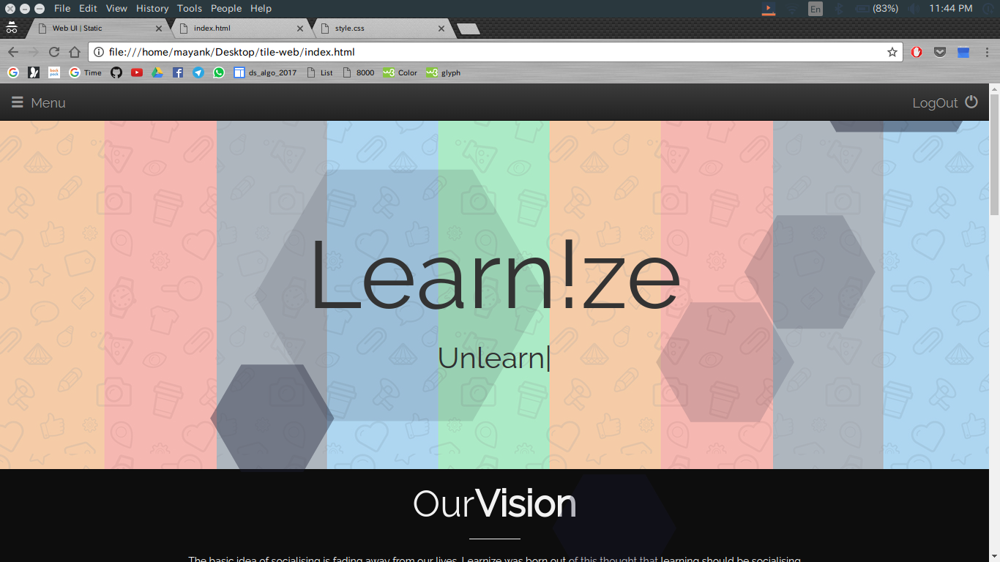
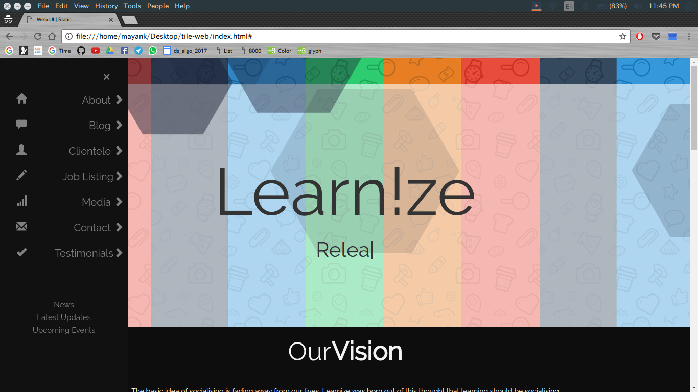
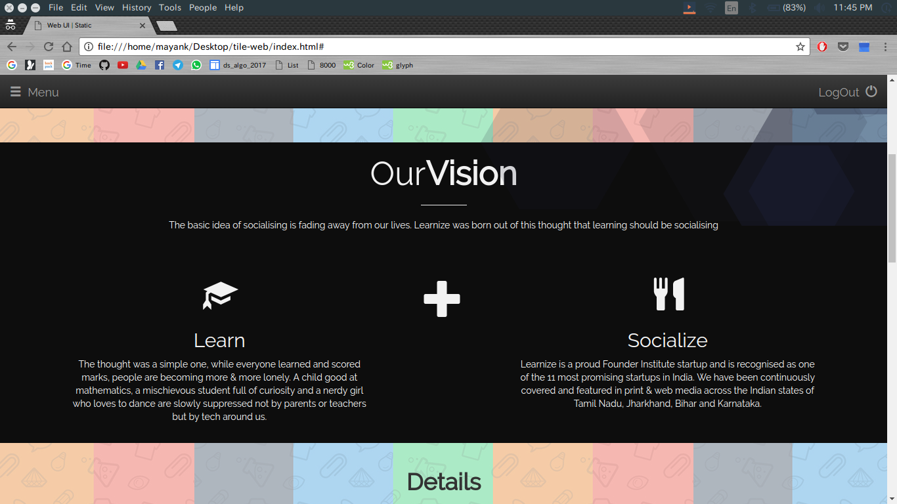
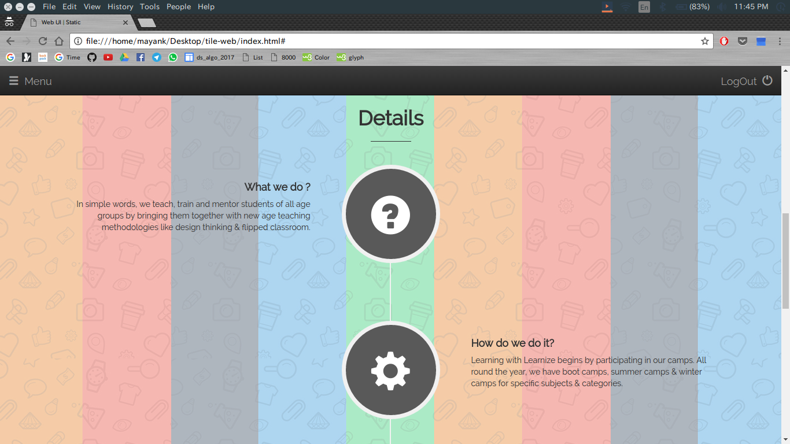
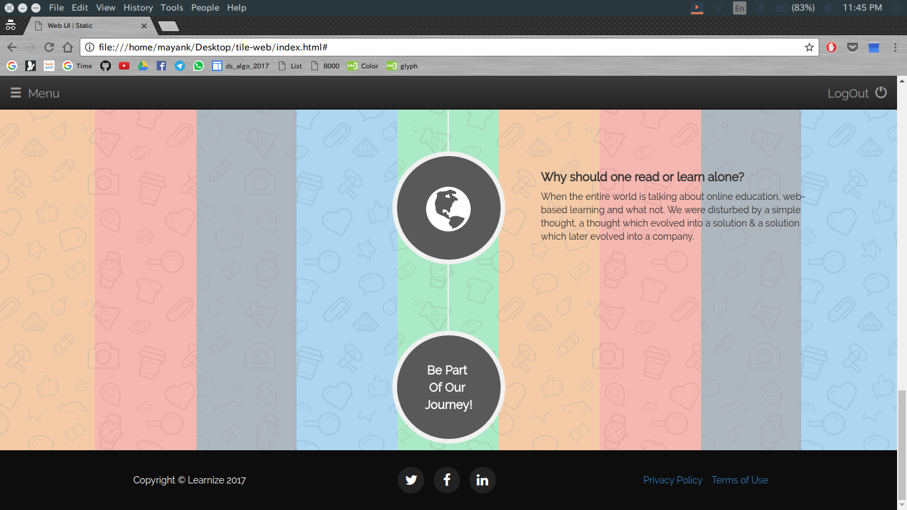

# tile-web
Website design UI

## Aim
It is mainly for display purposes.

## How to View
- Basic static website design
- Go To: https://mayankmtg.github.io/tile-web/

## Screenshots

 

 

## Technologies Used

- HTML
- CSS
- Javascript

## Libraries Used
- Bootstrap
- Animate.css
- Particles.js
- Typed.js
